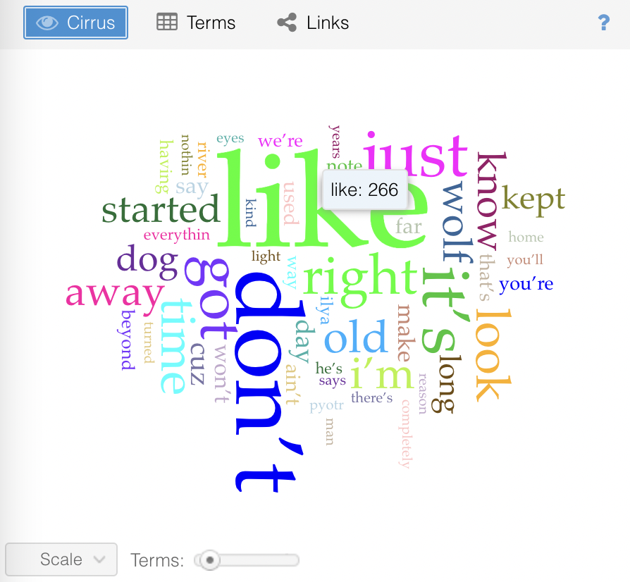
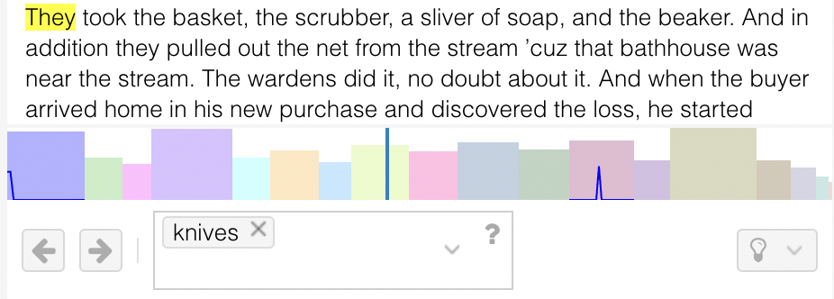
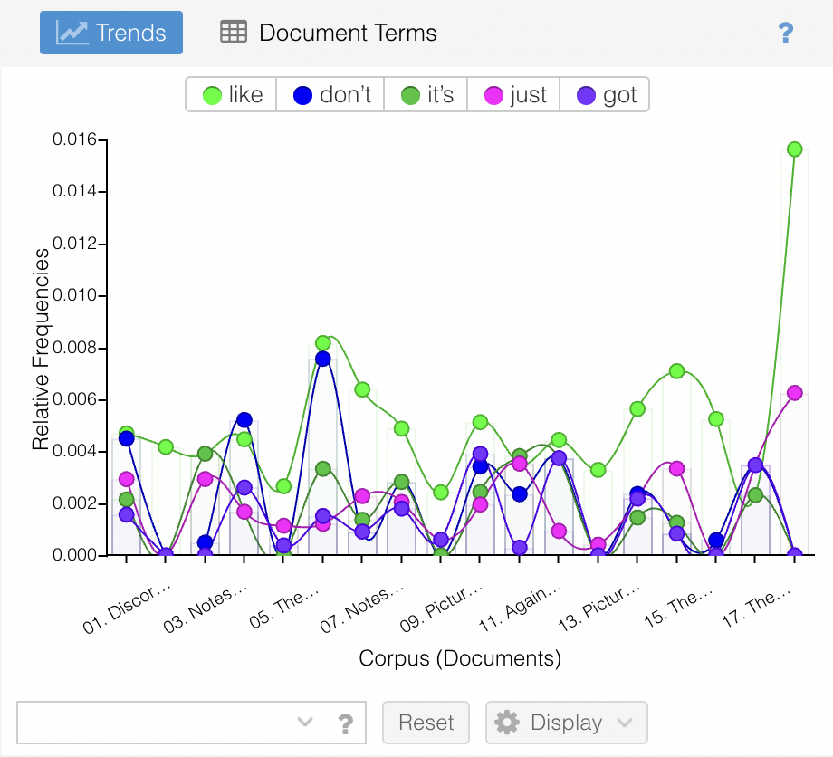
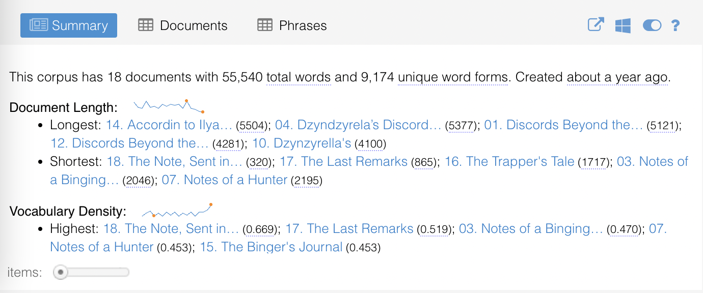
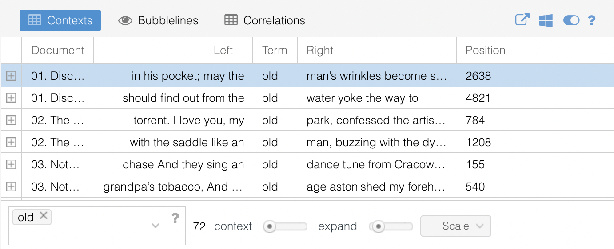

# Basic Exploration

When you first create a corpus in Voyant you are presented with a default "skin", or arrangement of tools.  You will notice that there are three tool panels along the top of the screen and two on the bottom. 

## Default Tools

Let's explore a few of the default tools included with Voyant and some of the options for interacting with them.

### 1. Cirrus

A word cloud showing the most frequently occuring words in the corpus or document. Hovering above a term will display its frequency.

Cirrus has a slider near the bottom (with the label "scale") that allows you to adjust the number of words displayed by increments of 25. By default the minimum value allowed is 25 and the maximum value is 500.

Clicking on the "options" icon (it looks like the power-on / power-off slider on an iPhone) provides you with a dialog box where additional settings can be modified. These include:

- Stopwords: a defined set of words to exclude from analysis
- White list: the opposite of a stopword list, a defined set of words that are allowed to be displayed in Cirrus
- Categories: defined sets of related words, which may, for example, be used for semantic analysis
- Font family: a web-safe set of fonts which you can choose for display
- Palette: the color palette used in display

### 2. Reader

A corpus reader that fetches segments of text as you scroll.  

The Reader tool has two components.  The first is the Text Reader, where text is displayed for reading with minimal formatting. Scrolling will enable you to fetch more content, hovering over a word will display its frequency within the document (*not* within the corpus), and clicking on a term will search for it within the Reader and in other tools if applicable. 

The second componenet of the Reader tool is the Prospect Reader, which looks like a series of colored boxes below the Text Reader. The Prospect Viewer provides an overview of the entire corpus, which is particularly useful if your corpus consists of multiple documents, like ours does!  The bars represent each document in the order they appear in the corpus, and the relative length of each document is represented both the height and width of the bar. A verticle blue bar will indicate the current position of the Text Reader in the corpus as you browse. You can click anywhere along the Prospect Viwer to jump to that point in the text.

You can specify search terms either by clicking on works in the Text Reader, or entering them into the query box at the bottom of the tool. When a search term is entered, a sparkline will appear within the bars of the Prospect Reader showing the relative frequency of that term accross the corpus. 

### 3. Trends

A distribution graph displaying the frequency of terms accross documents in a corpus (or segements in a document). 

Each series in the graph is coloured according to the word it represents. A legend at the top of the graph displays which words are associated with which colors. Clicking on words in the legend will affect their visibility in the graph. Hovering over any point in the graph activates a popup with information about that point, including the word, its frequency, and the document or document segment. For corpora consisting of multiple documents, like ours, double-clicking on a point allows you to "drill down" or view the frequency of that word accross a single document within the corpus.

If you would like to specify what terms are displayed on the graph, you can do so using the search box at the bottom of the tool panel.

The "display" button at the bottom of the tool panel allows you to display labels for each point and to apply a few different graphical visualizations to the data.

Clicking on the "reset" button at the bottom of this tool will return you to the default settings.

### 4. Summary

Provides a simple, textual overview of the current corpus, including the total word count, number of unique words, longest and shortest documents, the highest and lowest vocabulary density, average number of words per sentence, the most frequent words, notable peaks in word frequency, and distincitve words accross each document in the corpus. 

### 5. Contexts

A concordance tool that shows each occurrence of a keyword with a bit of its surrounding context. This can be useful for taking a closer look at how certain terms get used in different contexts. 

By default, this tool takes the appearnace of a table with four columns:

1. Document: the document in which the keyword and its contexts appear
2. Left: the contextual content appearing to the immediate left of the keyword in the document
3. Term: the keyword itself
4. Right: the contextual content appearing to the immediate right of the keyword in the document

By clicking on the caret at the top of any column you can choose to add an additional column called "position" to the table, which displays the position (token index) of the term in the document.

Use the search box at the bottom of the tool panel to specify which keyword to use with this tool. You can also use the "context" slider to specify how many words to consider as context on either side of the keyword, or the "expand" slider to specify how many words to display when you expand a given row. 

## Tool Interaction

An essential part of Voyant is that events in one tool can cause changes in other tools (the exact interactions depend on a number of factors, including which tools are visible). Try out the follow steps and see what takes place:

- click on a word in the Cirrus tool
- notice how the Trends tool now shows just the word you clicked
- click on one of the points in the Trends tool
- notice that the Contexts tool has updated with just the clicked word
- click the first row of the Contexts tool
- notice how the Reader tool has jumped to a location where that word appears, and hightlighted that instance of the word

---

[< Previous](3-corpus.md) | [Next >](5-advanced.md)
