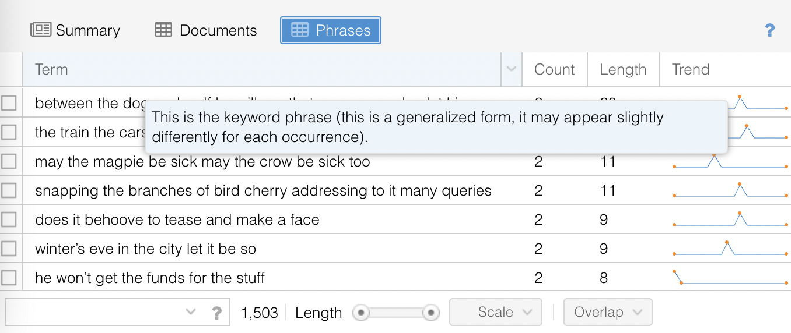
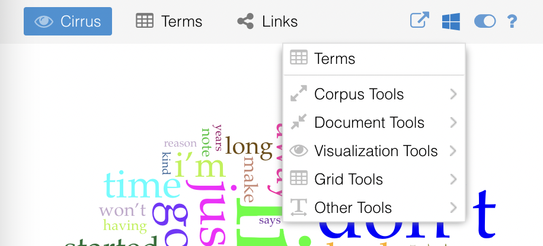

# Advanced Exploration

As a tool, Voyant represents an ongoing negotiation between simplicity and power: its design tries to provide a (relatively) simple interface while still allowing for more advanced operations. There are a few different strategies for getting the most out of Voyant.

## Searching

Several of the tools provided by Voyant support a search function. While it is possible to search for a single word, special syntax can be used to conduct more advanced searches. Here are some examples of that syntax, but if you forget, hovering over the "question" icon next to a search box will refresh your memory!

- __love__: exact word match
- __lov*__: combine all words that start with "lov"
- __^lov*__: separate all words that start with "lov"
- __love|loves__: combine all words separated by a pipe |
- __"he loves"__: exact phrase match
- __"she he love*"~10__: all words within a proximity of 10 words

## Grids

Grid-based tools (which look like spreadsheets) provide another example of some of Voyant's hidden functionality. Navigate to one of these tools and try out the following: 

- hover over the column header to get a short description of the column values
- some columns allow you to sort values by that column by clicking on it (and clicking again to reverse the order)
- most columns can be reordered by dragging and dropping the column headers
- most grids allow for row selection: select a row by clicking on it, select multiple rows by using the Shift or Ctrl/Command key
- some grids have checkboxes (leftmost column) that facilitate selecting multiple items
- selected rows should persist even when querying for additional data
- some grids have a plus icon (leftmost colunm) that allows the user to expand more information about that row
- most grids have "infinite scrolling" which means that more rows will be loaded dynamically as needed and as available
- hovering over most column headers will cause an arrow to appear in the right part of the column header, click on it for further options such as:
  - another way of sorting
  - a way of selecting additional columns to display

## Additional Tools

There are many analytical tools available in Voyant aside from the five that appear in the default "skin" or view. You may have already discovered one way of accessing some of these by clicking on a tab in one of the default tool panes. (For example, the Cirrus tool can be replaced by the Terms or Links tools simply by clicking on the tab).

These tabs are pre-programmed alternatives, but you can also choose from a much longer list of tools by clicking on the little window icon that appears when hovering over the header (either the blue header at the top of the page that replaces all of the tools in the window or the grey header in each tool panel that replaces just that tool). When exploring alternate tools, Voyant will provide suggestions using the following categories:

- the first tools above the line are recommended alternatives
- corpus tools: showing data about the corpus as a whole
- document tools: showing data about individual documents
- visualization tools: presenting data as charts, graphs, and other visual forms
- grid tools: presenting data primarily in tabular form
- other tools: various other forms of data presentation

For further information on all the tools supported by Voyant, refer to the [documentation](https://voyant-tools.org/docs/#!/guide/tools)!

---

[< Previous](4-defaults.md) | [Next >](6-beyond.md)
